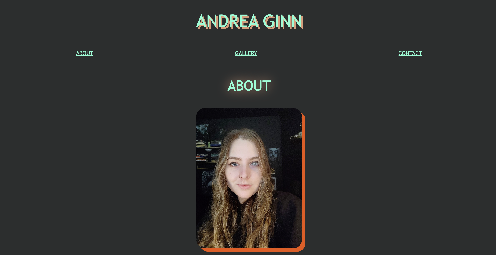

# Ginn-Portfolio

## Description

Created a stand-in portfolio (currently housing artwork, will house future code projects) using HTML and CSS. Focus included using flex to organize images, organizing smooth-scrolling, linking an image to my first assignment, and experimenting with styling choices. 

## Installation

Site deployed. URL: https://andreaginn.github.io/Ginn-Portfolio/

